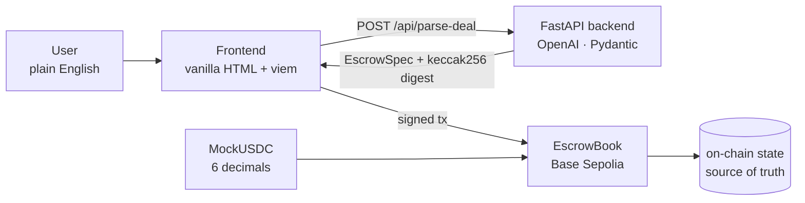

# Intent2Escrow

> Turn natural-language deal terms into verifiable on-chain settlement.

An AI-powered escrow dApp built for the MSX Web3 Hackathon (April 2026). Describe a deal in plain English or Chinese — an LLM parses it into a validated spec — funds enter a Solidity contract on Base Sepolia and release only when conditions are met.

## Live contracts (Base Sepolia)

| Contract | Address |
|----------|---------|
| EscrowBook | [`0x4DE20B4eC770DadfD403383Eb819f202C1d1272d`](https://sepolia.basescan.org/address/0x4DE20B4eC770DadfD403383Eb819f202C1d1272d) |
| MockUSDC | [`0x220BAc08b870EB6831F39c6E665FEfd156c5Bb38`](https://sepolia.basescan.org/address/0x220BAc08b870EB6831F39c6E665FEfd156c5Bb38) |

## Architecture



```
apps/web/index.html          — single-file frontend (viem, Tailwind CDN)
packages/backend/            — FastAPI + OpenAI structured outputs
contracts/src/EscrowBook.sol — Solidity escrow state machine
```

**Security boundary:** the LLM never decides who the payer is. `msg.sender` is always the payer. Prompt-injection attempts are flagged in warnings; the strict JSON schema rejects unknown fields.

## How to run

### Frontend

No build step needed — open `apps/web/index.html` directly in a browser (or serve with any static server). Requires MetaMask and the backend running on `:8000`.

### Backend

```bash
cd packages/backend
echo "OPENAI_API_KEY=sk-..." > .env   # fill in your key
pip install -r backend_requirements.txt
uvicorn app.main:app --port 8000 --reload
```

### Contract tests

```bash
cd contracts
forge test -vv
```

## How it works

1. **Describe** — type a deal in natural language (English or Chinese)
2. **Parse** — backend sends it to `gpt-4o-mini` with structured outputs; returns a validated `EscrowSpec` with deadlines, amount, payee address, and evidence requirements
3. **Sign** — frontend calls `approve → createEscrow → fund` in three wallet transactions
4. **Deliver** — payee submits an evidence string (URL, hash, etc.) on-chain
5. **Settle** — payer releases funds, or reclaims after the refund deadline

## Escrow state machine

```
Created → Funded → EvidenceSubmitted → Released
                 └──────────────────→ Refunded (past releaseDeadline)
```

If `evidenceRequired = false`, the payer can release directly from `Funded`.

## License

MIT
